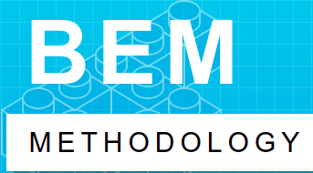
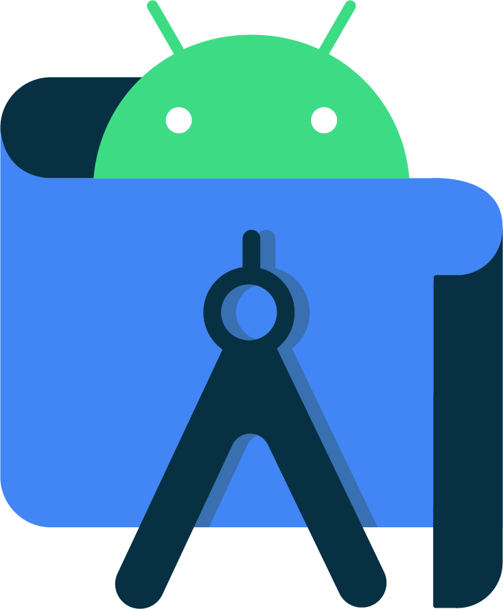

## Hi! My name is **Matheus Alves**

### I'm a web developer and (almost) a computer engineer 👨‍🎓

- 💻️ I'm currently looking for a **job / internship**
- 2️⃣0️⃣2️⃣2️⃣ goal: become a junior developer
- ☕️ is my preferred beverage

### I work with

[][html]
[][css]
[][javascript]
[][react]
[][express]
[][mongodb]
[][node]
[][npm]
[][webpack]
[][git]
[][github]
[][terminal]
[][vs-code]
[][bem]
[][scrum]
[][jira]
[][java]
[][android-studio]

### Connect with me

[][linkedin]
[][parler]
[][facebook]
[][youtube]

[html]: https://www.w3schools.com/html/default.asp
[css]: https://www.w3schools.com/css/default.asp
[javascript]: https://www.w3schools.com/html/default.asp
[react]: https://reactjs.org/
[express]: https://expressjs.com/pt-br/
[mongodb]: https://www.mongodb.com/
[node]: https://nodejs.org/en/
[npm]: https://www.npmjs.com/
[webpack]: https://webpack.js.org/
[git]: https://git-scm.com/
[github]: https://github.com/
[terminal]: https://ubuntu.com/tutorials/command-line-for-beginners#1-overview
[vs-code]: https://code.visualstudio.com/
[bem]: https://en.bem.info/methodology/
[scrum]: https://www.scrum.org/
[jira]: https://www.atlassian.com/br/software/jira
[java]: https://www.java.com/en/
[android-studio]: https://developer.android.com/studio?hl=pt&gclsrc=aw.ds&gclid=CjwKCAiA1uKMBhAGEiwAxzvX9343V_0TbPKa7TWIGfHwtQJwx69fJ2SwEG1N-Z_URuZfWX43w_0ZohoC11sQAvD_BwE
[linkedin]: https://www.linkedin.com/in/matheus4lves/
[parler]: https://parler.com/user/matheus4lves
[facebook]: https://www.facebook.com/profile.php?id=100003877646753
[youtube]: https://www.youtube.com/channel/UCOzFvIjNQ_h3nKWik71CTCQ