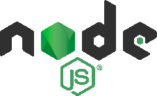

# Hi, my name is **Matheus Alves**

## I'm (almost) a computer engineer, full-stack web developer aspirant, and technical writer

- I'm currently looking for a **job / internship**
- **2025 goals**:
  - Earn freeCodeCamp's Responsive Web Design certification
  - Earn freeCodeCamp's A2 and B1 English for Developers certifications
  - Finish some Udemy courses
  - Become a junior developer

## Languages I speak

- English (intermediate/advanced)
- Portuguese (native)

## Tech stack I work with

  
  
  
  
  
  
  
  
  
  
  
  
  
  
  
  

## Latest blog posts

<!-- BLOG-POST-LIST:START -->
- [How to Install MongoDB with OpenSSL 3 Support on Fedora 39](https://dev.to/matheus4lves/how-to-install-mongodb-with-openssl-3-support-on-fedora-39-4nii)
- [Three Sentences That Changed My Way of Approaching Web Development.](https://dev.to/matheus4lves/three-sentences-that-changed-my-way-of-approaching-web-development-4hge)
- [How are HTML elements stacked by default?](https://dev.to/matheus4lves/how-html-elements-are-stacked-by-default-41fe)
- [Set Up Webpack 5 To Work With Static Files](https://dev.to/matheus4lves/set-up-webpack-5-to-work-with-static-files-52gk)
- [What’s the Difference Between path.join&lpar;&rpar; and path.resolve&lpar;&rpar;?](https://dev.to/matheus4lves/whats-the-difference-between-pathjoin-and-pathresolve-34ga)
<!-- BLOG-POST-LIST:END -->

## My stats

## Connect with me

[][linkedin]
[][x]
[][gettr]
[][dev.to]
[][hackernoon]
[][facebook]
[][youtube]

[linkedin]: https://www.linkedin.com/in/matheus4lves/
[x]: https://x.com/matheus4lvesfcc
[gettr]: https://gettr.com/user/matheus4lves
[dev.to]: https://dev.to/matheus4lves
[hackernoon]: https://hackernoon.com/u/matheus4lves
[facebook]: https://www.facebook.com/profile.php?id=100003877646753
[youtube]: https://www.youtube.com/channel/UCOzFvIjNQ_h3nKWik71CTCQ
